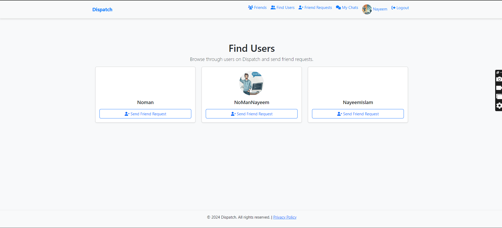

# Dispatch - Minimal Social Media Platform

**GitHub Repository:** [Dispatch](https://github.com/NoManNayeem/Dispatch.git)

## Project Description

Dispatch is a minimal social media platform designed for real-time chatting and communication between users. It features user management, real-time WebSocket-based chat, friend management, and options for voice and video calls. The backend is powered by Django and Django Channels, and the frontend uses Bootstrap for a modern and responsive UI.

## Features

- **User Registration and Login:** Users can register, log in, and manage their profiles.
- **Friend Management:** Users can send, accept, and decline friend requests.
- **Real-Time Chat:** WebSocket-based chat functionality allows users to communicate in real-time.
- **Chat History Storage:** Chat messages are stored in the database for future reference.
- **Video/Voice Calls (Planned):** Future versions will include video and voice call options using WebRTC.
- **Responsive Design:** The frontend is built with Bootstrap, ensuring a clean and responsive user interface.

## Project Structure

- **Django Backend:** Manages user authentication, chat, and friend relationships.
- **Django Channels:** Handles real-time messaging via WebSockets.
- **Redis:** Used as the channel layer for message passing.
- **SQLite/PostgreSQL:** Database for storing user, chat, and message data.

## Installation and Setup

### Prerequisites
- Python 3.12
- Django 5.1.2
- Redis
- Django Channels

### Clone the Repository

```bash
git clone https://github.com/NoManNayeem/Dispatch.git
cd Dispatch
```

### Install Dependencies

```bash
pip install -r requirements.txt
```

### Run Redis Server

```bash
redis-server
```

### Run Django Migrations

```bash
python manage.py migrate
```

### Start the Django Development Server

```bash
python manage.py runserver
```

### Access the Application

Go to `http://127.0.0.1:8000` in your web browser to access the application.

## Project Features

### 1. User Registration and Login

Users can sign up, log in, and manage their profiles. The app uses Django's built-in authentication system.

### 2. Friend Management

Users can send, receive, and accept/decline friend requests. A dedicated friend list is available to see current friends.

### 3. Real-Time Chat

The chat system uses Django Channels and WebSockets to provide real-time messaging between users. Chat messages are stored in the database for history.

### 4. Profile Management

Users can update their profile information, including profile pictures, and view their profile details.

### 5. Responsive UI

The platform is designed to work seamlessly on both desktop and mobile devices with a modern look and feel using Bootstrap.

## Screenshots

<p align="center">
  
  
  
</p>

<p align="center">
  
  
  
</p>

<p align="center">
  
  
</p>


## Docker Setup Instructions

This project is Dockerized to simplify development and deployment. Follow the steps below to run the project using Docker and Docker Compose.

### Prerequisites

- Ensure you have **Docker** and **Docker Compose** installed on your machine. You can install Docker by following the instructions [here](https://docs.docker.com/get-docker/).
- Install **Docker Compose** by following the instructions [here](https://docs.docker.com/compose/install/).

### Steps to Run the Project with Docker

1. **Clone the Repository**:

If you haven’t already cloned the repository, do so by running:

```bash
   git clone https://github.com/NoManNayeem/Dispatch.git
   cd Dispatch
```
2. **Create the .env File**:

- Before starting the Docker containers, create a .env file in the project root directory to store environment variables:
```bash
    touch .env
```
- Inside the .env file, add the following:
```bash
    SECRET_KEY=your-secret-key
    DEBUG=True
    ALLOWED_HOSTS=127.0.0.1,localhost
    REDIS_HOST=redis
    REDIS_PORT=6379
```
Make sure to replace your-secret-key with an actual secret key.


3. **Build the Docker Images:**:
Build the Docker images by running the following command:
```bash
    docker-compose build
```
This will create the necessary Docker images for your Django app and Redis.

4. **Run the Docker Containers:**:

```bash
    docker-compose up
```
5. **Apply Migrations**:
After starting the containers, you need to apply the database migrations:
```bash
    docker-compose exec web python manage.py migrate
```
6. **Collect Static Files (Optional):**:
If you're preparing the app for production, run the following command to collect static files:
```bash
    docker-compose exec web python manage.py collectstatic --noinput
```
7. **Access the Application:**:
The application will be available at `http://127.0.0.1:8000` in your web browser.

# Additional Docker Commands
- Stop the Containers: To stop the containers, run:
```bash
docker-compose down
```
- Rebuild the Docker Images (if you change dependencies):
```bash
docker-compose build
```
- Running Commands in the Container: To run any Django management commands inside the running container, use:
```bash
docker-compose exec web python manage.py <command>
```

## License

This project is open-source and available under the MIT License.

## Contact

If you have any questions or want to contribute, feel free to contact the repository owner through GitHub.
